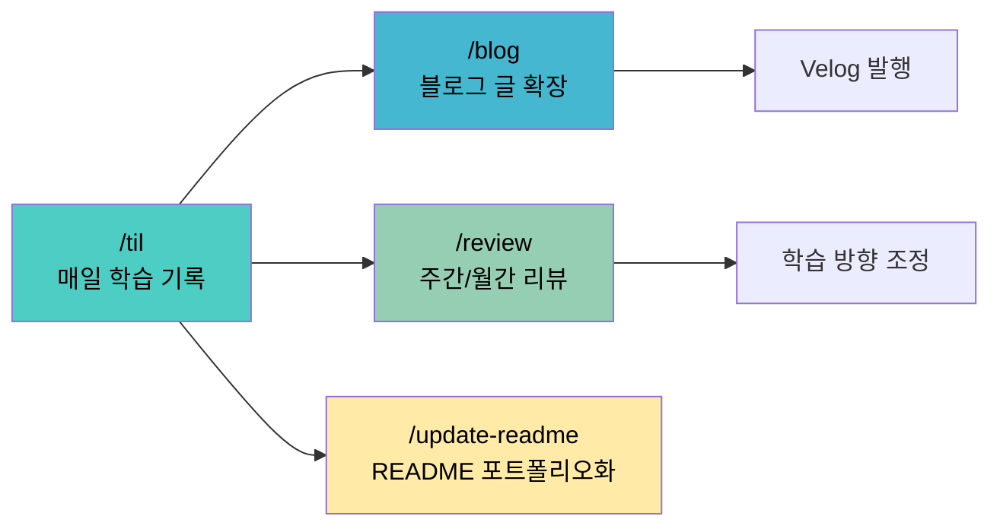
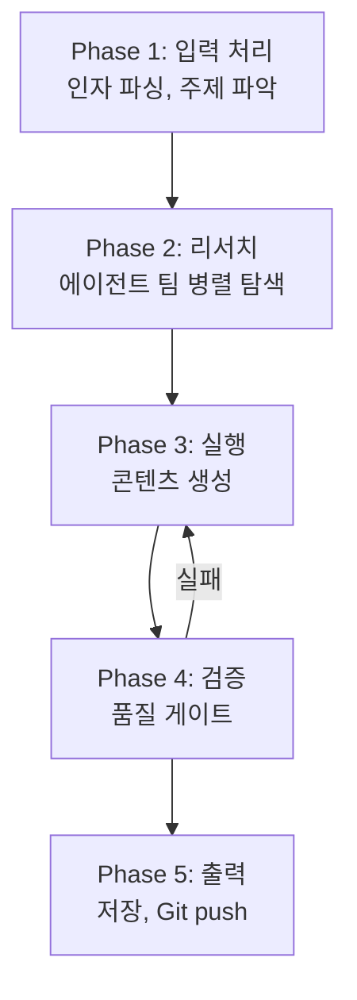
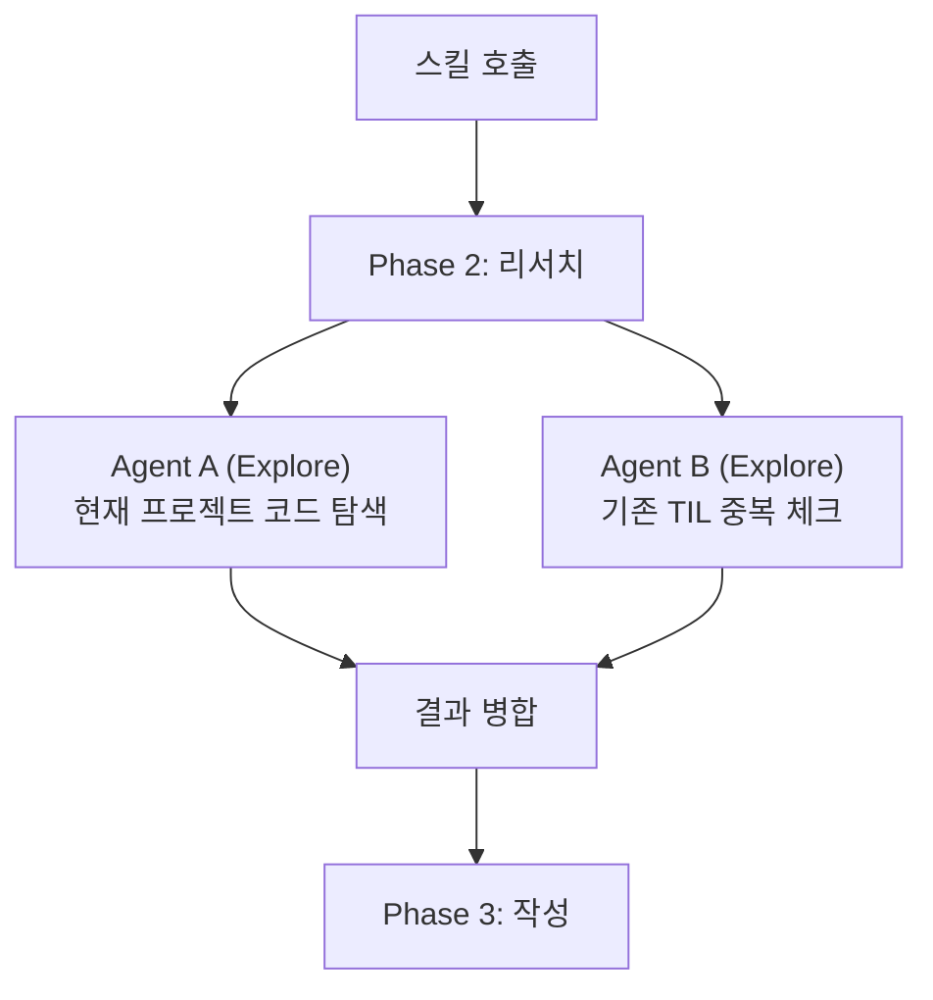
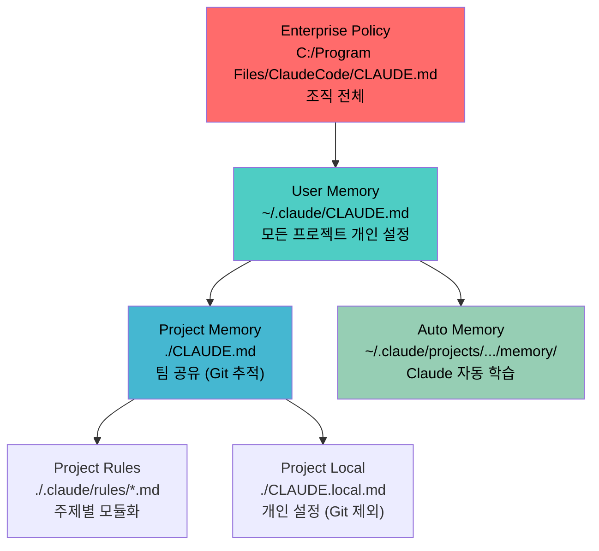

## 매일 TIL 쓰기가 왜 이렇게 귀찮을까

개발 공부를 하면서 매일 TIL(Today I Learned)을 쓰려고 시도했다. 첫 주는 괜찮았다. 둘째 주부터 파일 만들고, 카테고리 정하고, 커밋 메시지 쓰고, push하는 과정이 점점 귀찮아졌다. 블로그 글로 확장하는 건 더 심했다. 결국 "나중에 정리해야지" 하면서 쌓아두기만 했다.

Claude Code의 스킬 시스템을 알게 되면서 이 문제를 해결했다. `/til`이라고 치면 주제 파악부터 GitHub push까지 전부 자동으로 돌아간다. 이 글에서는 이 자동화 시스템을 어떻게 설계하고 구현했는지 공유한다.

## Claude Code 스킬이란

스킬은 Claude Code에서 재사용 가능한 프롬프트 템플릿이다. `~/.claude/skills/[스킬명]/SKILL.md`에 마크다운 파일 하나를 만들면 `/스킬명`으로 호출할 수 있다.

기존의 슬래시 커맨드(`.claude/commands/`)를 확장한 개념으로, 프론트매터로 호출 제어, 도구 접근 제한, 서브에이전트 실행까지 가능하다.

### 스킬의 핵심 구조

```
my-skill/
├── SKILL.md           # 메인 지시사항 (필수)
├── template.md        # Claude가 채울 템플릿 (선택)
├── examples/          # 예상 출력 형식 (선택)
└── scripts/           # Claude가 실행할 스크립트 (선택)
```

핵심은 `SKILL.md` 하나다. 이 파일에 프론트매터와 지시사항을 마크다운으로 작성한다.

### 프론트매터 주요 필드

| 필드 | 역할 | 예시 |
|------|------|------|
| `name` | 스킬 표시 이름 | `til` |
| `description` | 자동 로드 판단에 사용되는 설명 | `오늘 배운 것을 TIL로 기록` |
| `allowed-tools` | 스킬이 사용할 수 있는 도구 제한 | `Bash, Write, Read, Task` |
| `disable-model-invocation` | `true`면 사용자만 호출 가능 | `true` |
| `argument-hint` | 자동완성 시 인자 힌트 | `[주제]` |
| `context` | `fork`로 격리 실행 | `fork` |

`allowed-tools`가 특히 중요하다. 스킬이 사용할 수 있는 도구를 명시적으로 제한해서, 의도치 않은 파일 삭제나 시스템 변경을 방지한다.

## 설계: 포트폴리오 파이프라인

내가 구축한 시스템은 4개의 스킬이 하나의 파이프라인을 이룬다.



| 스킬 | 주기 | 입력 | 출력 |
|------|------|------|------|
| `/til` | 매일 | 학습 주제 | `til/[카테고리]/[파일].md` + Git push |
| `/blog` | 매주 | TIL 파일명 | `til/blog-drafts/[파일].md` |
| `/review` | 매주 | `week` 또는 `month` | `til/reviews/2026/week-XX.md` + Git push |
| `/update-readme` | 필요시 | (현재 프로젝트) | `README.md` 덮어쓰기 |

## 핵심 설계 패턴 4가지

4개의 스킬을 만들면서 반복적으로 사용한 패턴이 있다. 스킬을 직접 만들 때 이 패턴들을 조합하면 대부분의 자동화를 설계할 수 있다.

### 1. Phase 분리

모든 스킬은 명확한 단계로 나뉜다. 이렇게 하면 Claude가 한 단계씩 순서대로 실행하면서 중간 결과를 활용할 수 있다.



`/til` 스킬의 Phase 1을 예로 보면:

```markdown
## Phase 1: 주제 파악

1. 인자가 있으면 해당 주제 사용
2. 인자가 없으면:
   - 현재 디렉토리의 최근 git diff에서 주제 유추
   - 유추가 어려우면 사용자에게 질문
3. 카테고리 결정
4. 파일명 결정: kebab-case
```

각 Phase의 조건 분기와 실패 시 행동까지 명시해야 Claude가 정확하게 따른다.

### 2. 병렬 에이전트 리서치

리서치 단계에서 `Task` 도구로 2개 이상의 서브에이전트를 동시에 실행한다. 이것이 스킬 시스템의 가장 강력한 기능이다.



`/til` 스킬에서 실제 사용하는 패턴:

```markdown
## Phase 2: 리서치 (에이전트 팀 — 반드시 병렬 실행)

### Agent A: 현재 프로젝트 탐색
Task tool (subagent_type: Explore)
→ 관련 코드 조각, 파일별 사용 패턴, import 관계

### Agent B: 기존 TIL 탐색
Task tool (subagent_type: Explore)
→ 중복 체크, 관련 TIL 목록, 링크용 경로
```

에이전트 타입 선택이 중요하다:

| 에이전트 타입 | 사용 도구 | 용도 |
|---|---|---|
| `Explore` | Glob, Grep, Read (읽기 전용) | 코드/파일 탐색 |
| `general-purpose` | 모든 도구 (편집, 웹 검색 포함) | 심층 리서치, 분석 |
| `Plan` | 읽기 전용 | 설계/계획 수립 |

`/blog` 스킬은 두 타입을 혼합해서 쓴다 — Agent A(Explore)는 관련 TIL을 찾고, Agent B(general-purpose)는 웹 검색으로 깊이 있는 정보를 수집한다.

### 3. 템플릿 분기

입력 조건에 따라 다른 템플릿을 적용한다. `/til` 스킬은 주제에 "트러블슈팅", "에러", "해결" 같은 키워드가 있으면 트러블슈팅 전용 템플릿으로 전환한다.

**일반 TIL 흐름:**
```
제목 → 한줄 요약 → 핵심 포인트 → 코드 예시 → 주의점 → 관련 TIL
```

**트러블슈팅 TIL 흐름:**
```
제목 → 증상(에러 메시지) → 환경 → 원인 → 해결 코드 → 예방법
```

스킬 안에서 조건 분기를 명확히 기술하면 Claude가 알아서 판단한다:

```markdown
주제에 "트러블슈팅", "에러", "해결", "버그", "fix" 등의
키워드가 포함되면 트러블슈팅 템플릿을 사용한다.
```

### 4. 품질 게이트

저장 전에 체크리스트로 품질을 검증한다. 이게 없으면 Claude가 불완전한 결과물을 저장해버리는 경우가 생긴다.

```markdown
## Phase 4: 품질 체크

| 기준 | 필수/권장 |
|------|---------|
| 한줄 요약만 읽어도 핵심을 알 수 있는가? | 필수 |
| 6개월 후 내가 읽어도 바로 이해되는가? | 필수 |
| 검색 키워드가 제목과 태그에 포함되어 있는가? | 필수 |
| 코드 예시가 실제 프로젝트 기반인가? | 권장 |
| 불필요한 서론/사족 없이 핵심만 담겼는가? | 필수 |
```

## Claude Code만의 차별점

다른 AI 코딩 도구들도 커스텀 명령 시스템을 가지고 있다. Claude Code가 다른 점은 무엇일까?

### 커스텀 명령 시스템 비교

| 기능 | Claude Code | Cursor | GitHub Copilot | Windsurf |
|---|---|---|---|---|
| **설정 파일** | `skills/SKILL.md` | `.cursor/rules/*.mdc` | `.github/copilot-instructions.md` | `.windsurf/rules/*.md` |
| **서브에이전트** | `context: fork`로 격리 실행 | 없음 | 제한적 | 제한적 |
| **동적 컨텍스트** | `` !`command` `` 전처리 | 없음 | 없음 | 없음 |
| **도구 제한** | `allowed-tools` 필드 | 없음 | 없음 | 없음 |
| **인자 전달** | `$ARGUMENTS`, `$0`, `$1` | 없음 | 없음 | 없음 |
| **자동 메모리** | Auto Memory (세션 간 학습) | 없음 | 없음 | Memories 파일 |
| **오픈 표준** | Agent Skills 표준 | 독자 형식 | 독자 형식 | 독자 형식 |

Claude Code의 핵심 차별점 세 가지:

**1. 서브에이전트 실행** — 스킬 안에서 병렬 에이전트를 돌릴 수 있다. 다른 도구들은 단일 프롬프트만 가능하다.

**2. 동적 컨텍스트 주입** — `` !`gh pr diff` `` 같은 셸 명령을 스킬 로드 시점에 실행해서 결과를 주입할 수 있다. PR 리뷰 스킬에서 현재 diff를 자동으로 가져오는 식이다.

**3. 도구 접근 제한** — `allowed-tools`로 스킬이 사용할 수 있는 도구를 명시적으로 제한한다. `/review` 스킬은 웹 검색이 필요 없으므로 `WebSearch`를 빼두면 안전하다.

## CLAUDE.md: 모든 세션에 적용되는 글로벌 지침

스킬과 함께 이해해야 할 것이 CLAUDE.md 시스템이다. 계층 구조로 되어 있어서 범위별로 다른 지침을 적용할 수 있다.



내 글로벌 CLAUDE.md에는 이런 내용이 들어있다:

```markdown
## Developer
- Name: 정바다
- GitHub: https://github.com/Krocean

## Portfolio System
- /til, /blog, /review, /update-readme 4개 스킬
- TIL 저장소: C:/Users/wwwoc/til/
- 커밋 메시지: "TIL: [한줄 설명]"
- 파일명: kebab-case
```

이렇게 해두면 어떤 프로젝트에서든 Claude가 나의 포트폴리오 시스템 맥락을 알고 있다.

**주의:** CLAUDE.md는 매 세션마다 로드되므로 핵심적이고 보편적인 내용만 넣어야 한다. 너무 길면 Claude가 중요한 규칙을 놓칠 수 있다.

## Auto Memory: 세션을 넘어서 기억하기

Claude Code에는 Auto Memory라는 독특한 기능이 있다. `~/.claude/projects/[프로젝트경로]/memory/MEMORY.md`에 Claude가 스스로 학습한 내용을 저장한다.

**작동 방식:**
- `MEMORY.md`의 처음 200줄만 매 세션 시작 시 시스템 프롬프트에 자동 로드
- 200줄을 넘기면 별도 토픽 파일(`debugging.md`, `patterns.md`)로 분리
- 토픽 파일은 Claude가 필요할 때 직접 읽음

**저장되는 것:**
- 프로젝트 패턴 (빌드 명령, 테스트 규칙, 코드 스타일)
- 디버깅 인사이트 (까다로운 문제 해결법)
- 사용자 선호도 (워크플로우 습관)

이 기능 덕분에 새 세션을 열어도 이전에 학습한 맥락이 유지된다. 다른 AI 코딩 도구들은 매번 처음부터 시작하지만, Claude Code는 점점 나에게 맞춰진다.

## 실전에서 주의할 점

스킬 시스템을 쓰면서 배운 실수와 해결법을 정리했다.

**1. 컨텍스트 오염 — "Kitchen Sink Session"**

하나의 세션에서 관련 없는 여러 작업을 수행하면 컨텍스트가 오염된다. TIL 쓰다가 버그 수정하다가 README 업데이트하면 Claude가 맥락을 혼동한다.

해결: 관련 없는 작업 사이에 `/clear`로 컨텍스트를 초기화한다.

**2. 반복 수정의 악순환**

Claude가 잘못된 결과를 낼 때 같은 세션에서 계속 수정을 시도하면, 실패한 시도들이 컨텍스트에 쌓여서 더 나빠진다.

해결: 2회 수정 실패 후 `/clear`하고 더 나은 초기 프롬프트를 작성한다.

**3. 과도한 CLAUDE.md**

CLAUDE.md에 모든 규칙을 다 넣으면 Claude가 중요한 규칙을 놓친다.

해결: 핵심만 남기고, 특정 도메인 지식은 스킬이나 `.claude/rules/`로 분리한다.

**4. allowed-tools 미설정**

스킬에 `allowed-tools`를 안 쓰면 Claude가 불필요한 도구까지 접근할 수 있다. 예를 들어 리뷰 스킬이 파일을 편집하거나, TIL 스킬이 시스템 설정을 건드리는 일이 생길 수 있다.

해결: 각 스킬에 필요한 최소한의 도구만 명시한다.

| 스킬 | 포함 도구 | 제외한 것과 이유 |
|------|---------|--------|
| `/til` | Bash, Write, Read, Glob, Grep, Edit, Task, WebSearch, WebFetch | — (풀세트 필요) |
| `/blog` | Bash, Write, Read, Glob, Grep, Edit, Task, WebSearch, WebFetch | — (웹 리서치 필요) |
| `/review` | Bash, Write, Read, Glob, Grep, Task | WebSearch 제외 (로컬 분석만) |
| `/update-readme` | Bash, Write, Read, Glob, Grep, Edit, Task | WebSearch 제외 (프로젝트 내부만) |

## 정리

- Claude Code의 스킬 시스템은 SKILL.md 하나로 복잡한 자동화 워크플로우를 만들 수 있다
- 핵심 패턴 4가지 — Phase 분리, 병렬 에이전트, 템플릿 분기, 품질 게이트 — 를 조합하면 대부분의 반복 작업을 자동화할 수 있다
- 서브에이전트 실행, 동적 컨텍스트 주입, 도구 접근 제한은 Claude Code만의 차별점이며, 이 기능들이 스킬을 단순한 프롬프트 템플릿 이상으로 만들어준다

## 참고

- [Claude Code Skills 공식 문서](https://code.claude.com/docs/en/skills)
- [CLAUDE.md 작성 가이드 — Anthropic 블로그](https://claude.com/blog/using-claude-md-files)
- [Claude Code Best Practices](https://code.claude.com/docs/en/best-practices)
- [Agent Skills 오픈 표준](https://agentskills.io)
- [Claude Code Memory 관리](https://code.claude.com/docs/en/memory)
